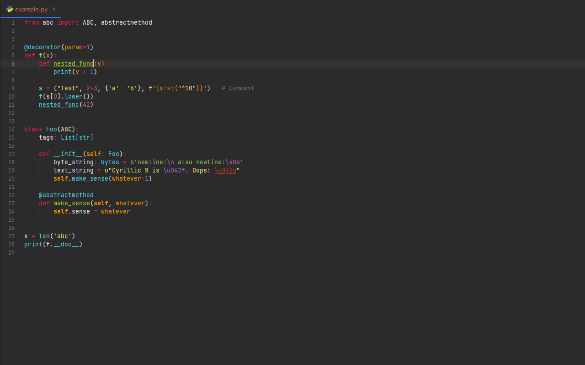
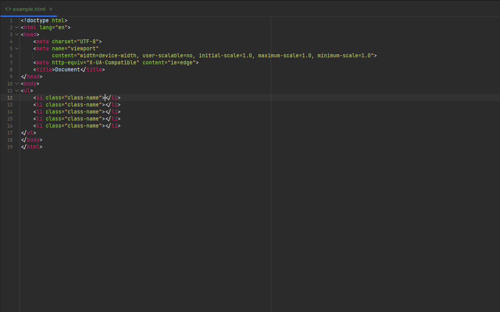
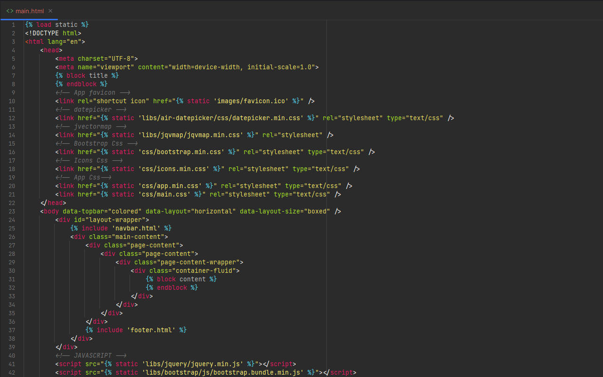
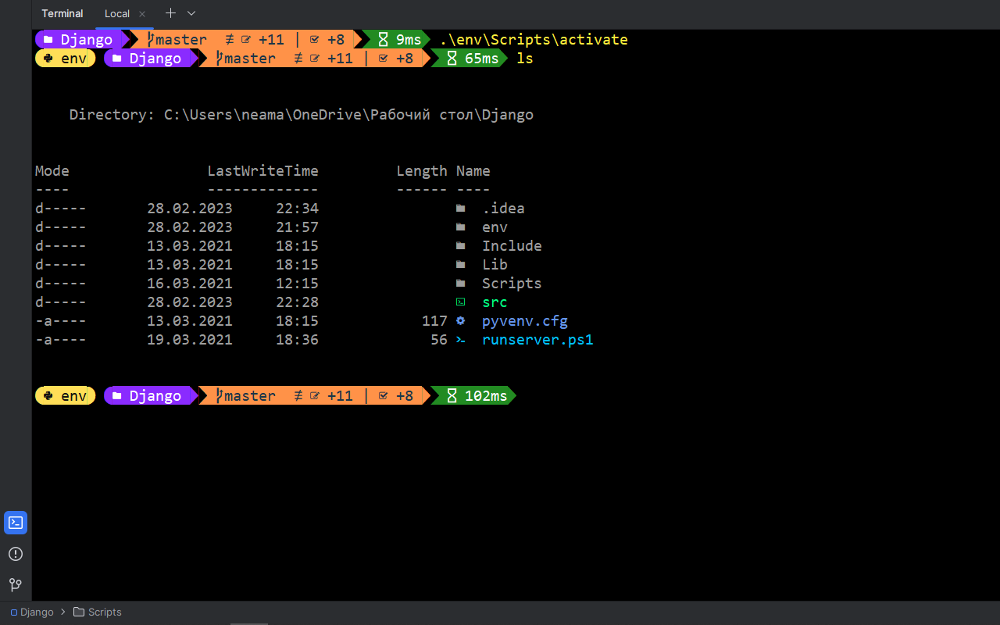

# Monokai by Neo

The Monokai theme as in [Sublime Text](https://www.sublimetext.com/), which I tried to repeat as closely as possible (at least for Python). Not a perfect copy, but better than the rest of the themes for you if you decide to switch to Pycharm after Sublime like me.

## Examples

### Python

### HTML

### Template for Django

## Installing

### As plugin

Requires IDE restart.

1. Go to "Preferences" -> "Plugins"
2. Select "Marketplace"
3. Search for "Monokai by Neo"
4. Click "Install"

### As color scheme

Doesn't require IDE restart.

1. Download either [Monokai Materialized.jar](Monokai_by_Neo.jar) or [colors/Monokai Materialized.xml](colors/Monokai%20By%20Neo.xml) (you may need to change extension form `xml` to `.icls`)
2. Go to "Preferences" -> "Editor" -> "Color scheme"
3. Click "cog icon" and select "Import Scheme" and then "Color scheme (.icls) or settings (.jar)"
4. Select downloaded file

## Font

Recommended font for this color scheme is [Hasklig](https://github.com/wclr/my-nerd-fonts/tree/master/Consolas%20NF).
[Consolas NF](https://github.com/wclr/my-nerd-fonts/tree/master/Consolas%20NF) is set as the font for the console, it is needed for the correct display of unicode characters, because i use [Oh My Posh](https://ohmyposh.dev/)

## License

This project is licensed under the MIT License. See the [LICENSE](LICENSE) file for details.
